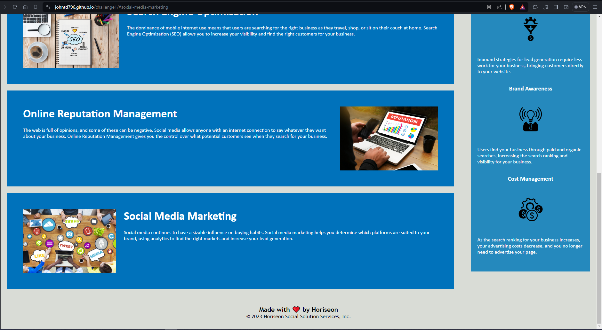

# Code Refactor Starter Code
This challenge gave me a better understanding of how webpage is structured using HTML elements, as well as how to look for repetetive code and consolidate it. I also ran into a handful of issues that i had experienced with the prework-study-guide which further reinforced solutions I had previously used. Overall this was a great learning experince in cleaning up and debuggin code.
 
    <!-- screenshot of top half of the webpage -->

    <!-- screenshot of bottom half of the webpage -->
<link href="https://johntd796.github.io/challenge1/">
    <!-- link to deployed application -->